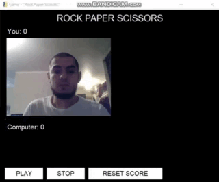

# Проект "Rock Paper Scissors"

Rock Paper Scissors - это всем известная игра, где пользователь будет играть с компьютером.

## Реализация
Для обучения модели YOLOV5 будем использовать сервис Google Colab
За основу взят репозиторий [ultralytics](https://github.com/ultralytics/yolov5).

## Установка
    $ git clone https://github.com/ultralytics/yolov5
    $ cd yolov5
    $ pip install -r requirements.txt

## Структура датасета
    /dataset
    --/images
        --/train
      --/valid
    --/labels
        --/train
      --/valid
    --dataset.yaml

Файлы изображений и меток разделены по разным папкам, в корне лежит файл конфигурации **yaml**, который имеет следующий формат:

    train: ../dataset/images/train/ 
    val: ../dataset/images/valid/
    
    nc: 1 # количество классов
    names: ['class_0'] # имена классов

## Раметка

Для разметки изображений можно использовать сервис [Roboflow](https://roboflow.com/).

## Обучение
 
Скопируйте ваш датасет из Google диска и разархивируйте его:

    !cp /content/drive/MyDrive/dataset.rar /content
    !unrar x /content/newdataset.rar

Обучите вашу модель:

    !python train.py --img 640 --batch 32 --epochs 220 --data /content/yolov5/dataset/data.yaml --weights yolov5m.pt --cache
--data, путь к датасету

--img, разрешение картинки

--epochs, количество эпох - рекомендуется 300-500

--cfg, конфиг размера s/m/l

--weights, стартовые веса

После обучения можно сохранить лучшую модель, которая расположена в
..runs/train/exp/weights/best.pt...

## Интерфейс

Запускаем модель с помощью:

+ Скрипта detect.py указав веса модели и файл для детекцции;
+ Torch Hyb.
***
    model = torch.hub.load('\content\yolov5', 'custom',
                            path="\content\yolov5\\runs\\train\exp\weights\\best.pt",
                            source='local')
        img = 'D:\content\camera.jpg'
        results = model(img) 

## Работа с графическим интерфейсом

* PLAY - начало игры;
* STOP - завершение игры;
* RESET - обнуление счета.

